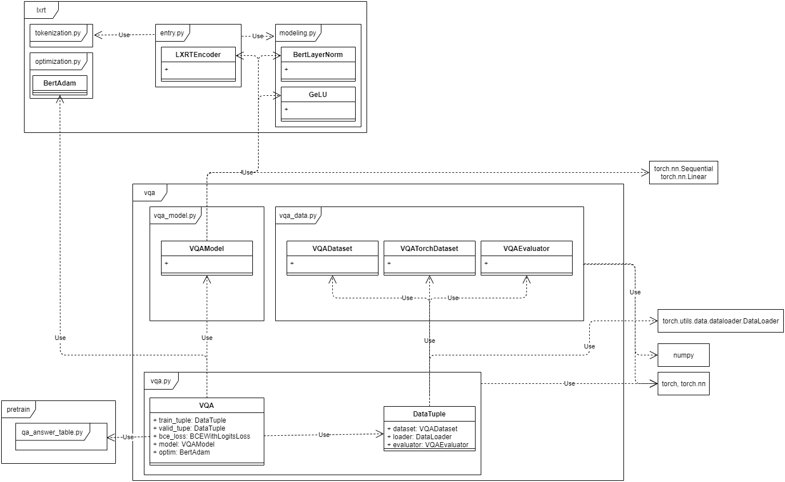
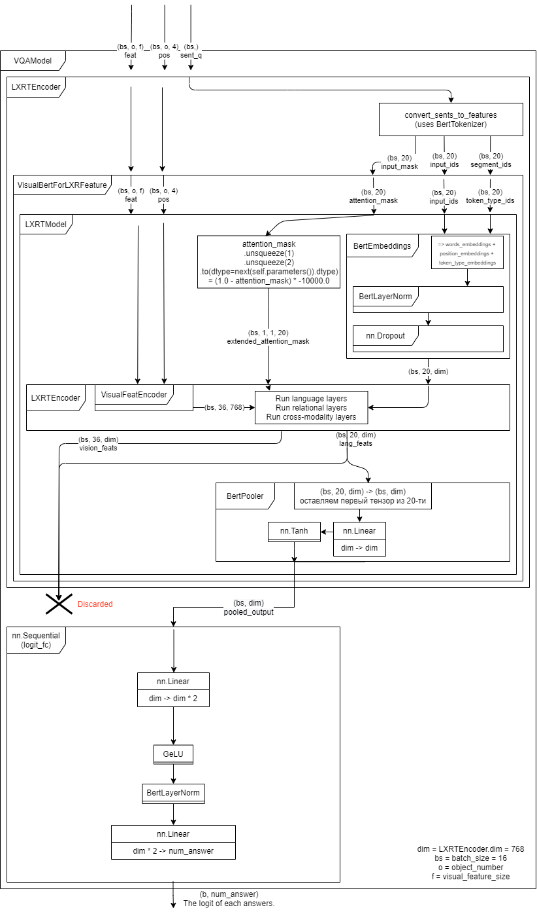

# VQA by [LXMERT](https://github.com/airsplay/lxmert)

## Требуемый контент

Нужно перейти по [ссылке](https://drive.google.com/drive/folders/1Gq1uLUk6NdD0CcJOptXjxE6ssY5XAuat)
и скачать следующие файлы:
- `lxmert_data/snap/pretrained/model_LXRT.pth` в `./snap/pretrained/model_LXRT.pth`
- `lxmert_data/image_feature_zips/mscoco_imgfeat.zip`, разархивировать в `./data/mscoco_imgfeat/*.tsv`
- `lxmert_data/data/vqa/*.json` в `./data/vqa/*.json`

# Структура проекта

## Файловая структура

```
.
├───data # Датасеты и данные
│   ├───lxmert # Дополнительный список ответов TODO: Уточнить, для чего он нужен
│   ├───mscoco_imgfeat # Датасет размеченных изображений с их features
│   └───vqa # Датасет вопросов-ответов
├───snap # Вывод
│   ├───pretrained # Pre-trained основа LXRT
│   └───vqa # Вывод finetune и predict
└───src # Код
    ├───lxrt # Реализация основных подмоделей нейросети, оптимизации, токенизации
    ├───pretrain # Загрузка и восстановление весов QA сети
    ├───tasks # Точки входа в проект
    └───vqa # Основная логика проекта
```

## Зависимости модулей



## Диаграмма основной нейросети



## Описание модулей

### [nn.Module](https://pytorch.org/docs/stable/generated/torch.nn.Module.html)

`nn.Module` из torch - это базовый класс всех модулей нейронной сети. 
Он реализует определение каждого уровня сети, а также механизм прямого вычисления 
и обратного распространения в классе (метод вычисления градиента, который используется 
при обновлении весов многослойного перцептрона - модели восприятия информации мозгом)

```py
# VQA Answer heads 
self.logit_fc = nn.Sequential(
    nn.Linear(hid_dim, hid_dim * 2), 
    GeLU(), BertLayerNorm(hid_dim * 2, eps=1e-12), 
    nn.Linear(hid_dim * 2, num_answers) 
)
```

Выше представлено создание секвинциальной/последовательной модели, состоящей из 4 слоёв, описанных ниже

### [nn.Sequential](https://pytorch.org/docs/stable/generated/torch.nn.Sequential.html)

Контейнер `nn.Sequential` (наследующий `nn.Module`) представляет собой хранение в каскадном виде, 
в данном случае результаты _(выходные данные)_ первого слоя будут передаваться на второй слой, 
результаты второго слоя – на третий и так по аналогии. Эта каскадность пути и отличает 
`nn.Sequential` от `nn.ModuleList`, который является именно контейнером для хранения _«Модулей»_

### [nn.Linear](https://pytorch.org/docs/stable/generated/torch.nn.Linear.html)
`nn.Linear` – слой, на котором происходит линейная трансформация данных по формуле 
. 
Входными аргументами являются in_features – размер каждого входного экземпляра, 
out_features – размер каждого выходного экземпляра, bias – True или False, по умолчанию истина, 
что означает что будет происходить вычисление смещения. 
Атрибуты экземпляра данного класса: weight – обучаемые веса модуля фигуры 
(экземпляр класса nn.Parameter, наследующего tourch.Tensor), 
bias – обучаемые смещения модуля фигуры (экземпляр класса nn.Parameter, наследующего tourch.Tensor)

### [GeLU](https://paperswithcode.com/method/gelu) [(реализация)](src/lxrt/modeling.py#L122)

GeLU (Gaussian Error Linear Units) – функция активации, служит активацией по умолчанию для таких моделей, как BERT. 
Смотря на график для гауссовой погрешности линейной единицы, можно сказать, что он имеет отрицательный коэффициент, 
который смещается в положительный коэффициент. Когда x больше нуля, выходное значение будет равно x, 
за исключением случаев, когда x = 0 до x = 1, где он слегка наклоняется к меньшему значению y.
Эта функция позволяет предотвращать проблему исчезающих градиентов.

